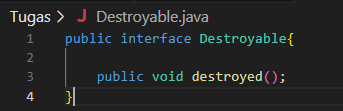

**Nama : Ratnasari**
**Kelas : TI 2C**
**Absen : 21**
**NIM : 2241720007**

**PERCOBAAN 1**
Output : 

**4.2 Pertanyaan**

1. Class apa sajakah yang merupakan turunan dari class Employee?
   Jawaban :
   InternshipEmployee dan PermanentEmployee

2. Class apa sajakah yang implements ke interface Payable?
   Jawaban :
   PermanentEmployee dan ElectricityBill

3. Perhatikan class Tester1, baris ke-10 dan 11. Mengapa e, bisa diisi
   dengan objek pEmp (merupakan objek dari class PermanentEmployee)
   dan objek iEmp (merupakan objek dari class
   InternshipEmploye) ?
   Jawaban :
   Karena pEmp (merupakan objek dari class PermanentEmployee)
   dan objek iEmp (merupakan objek dari class
   InternshipEmploye) merupakan class Turunan dari Employee, yang mana pada baris tersebut e merupakan Employee.

4. Perhatikan class Tester1, baris ke-12 dan 13. Mengapa p, bisa diisi
   dengan objek pEmp (merupakan objek dari class
   PermanentEmployee) dan objek eBill (merupakan objek dari class
   ElectricityBill) ?
   Jawaban :
   Object p (dideklarasi dari interface Payable) bisa digunakan untuk mereferensi ke
   objek pEmp (objek dari PermanentEmployee) dan objek eBill (object dari
   ElectricityBill) karena merupakan implements dari interface Payable

5. Coba tambahkan sintaks:
   p = iEmp;
   e = eBill;
   pada baris 14 dan 15 (baris terakhir dalam method main) ! Apa yang
   menyebabkan error?
   Jawaban :
   Error terjadi karena objek iEmp tidak implements ke interface Payable dan objek
   eBill bukan turunan dari class Employee

6. Ambil kesimpulan tentang konsep/bentuk dasar polimorfisme!
   Jawaban :
   Polimorfisme adalah kemampuan untuk menggunakan satu antamuka ata nama
   method untuk berbagi tipe object atau kelas yang berbeda. Polimorfisme
   memungkinkan object yang berasal dari kelas yang berbeda untuk merespon
   panggilan method dengan perilaku yang sesuai dengan object tersebut

**PERCOBAAN 2**
Output : 

**5.2. Pertanyaan**

1. Perhatikan class Tester2 di atas, mengapa pemanggilan e.getEmployeeInfo() pada baris 8 dan
   pEmp.getEmployeeInfo() pada baris 10 menghasilkan hasil sama?
   Jawaban :
   Karena class PermanentEmployee merupakan turunan dari Class Employee
   sehingga terdapat method yang sama / overriding method antara 2 class tersebut
   sehingga menghasilkan output yang sama

2. Mengapa pemanggilan method e.getEmployeeInfo() disebut sebagai
   pemanggilan method virtual (virtual method invication), sedangkan
   pEmp.getEmployeeInfo() tidak?
   Jawaban :
   Saat compile time kode e.getEmployeeInfo(), compiler mengenali method
   getEmployeeInfo() yang akan dipanggil adalah method getEmployeeInfo() yang ada
   di class Employee. Tetapi saat dijalankan maka yang dijalankan justru method
   getEmployeeInfo() yang ada di class PermanentEmployee. Maka dari itu disebut
   virtual method invication. Sedangkan pada kode pEmp.getImployeeInfo() method
   yang dikenali merupakan method class PermanentEmployee maka dari itu tidak
   dianggap virtual method invication

3. Jadi apakah yang dimaksud dari virtual method invocation? Mengapa
   disebut virtual?
   Jawaban :
   Virtual method invication terjadi ketika ada pemanggilan overriding method dari
   suatu objek polimorfisme. Disebut virtual karena antara method yang dikenali oleh
   compiler dan method yang dijalankan oleh JVM berbeda

**PERCOBAAN 3**
Output : 

**6.2. Pertanyaan**

1. Perhatikan array e pada baris ke-8, mengapa ia bisa diisi dengan objekobjek dengan tipe yang berbeda, yaitu
   objek pEmp (objek dari PermanentEmployee) dan objek iEmp (objek dari InternshipEmployee) ?
   Jawaban :
   Karena array e dideklarasi dari class Employee yang merupakan superclass dari
   class PermanentEmployee dan class IntershipEmployee

2. Perhatikan juga baris ke-9, mengapa array p juga diisi dengan objek-objek
   dengan tipe yang berbeda, yaitu objek pEmp (objek dari PermanentEmployee) dan objek eBill (objek dari
   ElectricityBilling) ?
   Jawaban :
   Karena array p dideklarasikan dari class Payable yang merupakan interface dari
   class PermanentEmployee dan class ElectricityBill

3. Perhatikan baris ke-10, mengapa terjadi error?
   Jawaban :
   Karena object eBill bukan turunan dari class Employee

**PERCOBAAN 4**

**7.2 Pertanyaan**

1. . Perhatikan class Tester4 baris ke-7 dan baris ke-11, mengapa pemanggilan ow.pay(eBill) dan ow.pay(pEmp) bisa dilakukan, padahal jika diperhatikan method pay() yang ada di dalam class Owner
   memiliki argument/parameter bertipe Payable? Jika diperhatikan lebih detil eBill merupakan objek dari
   ElectricityBill dan pEmp merupakan objek dari PermanentEmployee?
   Jawaban :
   Karena class ElectricityBill dan class PermanentEmployee merupakan implementasi
   dari class Payable, sehingga method pay() bisa menerima argument berupa object dari
   class ElectricityBill dan class PermanentEmployee

2. Jadi apakah tujuan membuat argument bertipe Payable pada method
   pay() yang ada di dalam class Owner?
   Jawaban :
   Agar method pay() bisa menerima argument berupa object dari ElectricityBill dan
   PermanentEmployee yang merupakan implements dari class Payabl

3. Coba pada baris terakhir method main() yang ada di dalam class
   Tester4 ditambahkan perintah ow.pay(iEmp);
   Mengapa terjadi error?
   Jawaban :
   Karena object iEmp dideklarasi dari class IntershipEmployee yang bukan implements
   dari class Payable

4. Perhatikan class Owner, diperlukan untuk apakah sintaks p
   instanceof ElectricityBill pada baris ke-6 ?
   Jawaban :
   Untuk mengecek apakah object p merupakan intansiasi dari class ElectricityBill

5. Perhatikan kembali class Owner baris ke-7, untuk apakah casting objek
   disana (ElectricityBill eb = (ElectricityBill) p)
   diperlukan ? Mengapa objek p yang bertipe Payable harus di-casting ke
   dalam objek eb yang bertipe ElectricityBill
   Jawaban :
   Untuk mengubah tipe dari object dari superclass /Payable ke subclass / ElectricityBill

**TUGAS**
Dalam suatu permainan, Zombie dan Barrier bisa dihancurkan oleh Plant dan
bisa menyembuhkan diri. Terdapat dua jenis Zombie, yaitu Walking Zombie dan
Jumping Zombie. Kedua Zombie tersebut memiliki cara penyembuhan yang
berbeda, demikian juga cara penghancurannya, yaitu ditentukan oleh aturan
berikut ini:
• Pada WalkingZombie
o Penyembuhan : Penyembuhan ditentukan berdasar level zombie
yang bersangkutan
§§ Jika zombie level 1, maka setiap kali penyembuhan, health
akan bertambah 20%
§§ Jika zombie level 2, maka setiap kali penyembuhan, health
akan bertambah 30%
§§ Jika zombie level 3, maka setiap kali penyembuhan, health
akan bertambah 40%
o Penghancuran : setiap kali penghancuran, health akan berkurang
2%
• Pada Jumping Zombie
o Penyembuhan : Penyembuhan ditentukan berdasar level zombie
yang bersangkutan
§§ Jika zombie level 1, maka setiap kali penyembuhan, health
akan bertambah 30%
§§ Jika zombie level 2, maka setiap kali penyembuhan, health
akan bertambah 40%
§§ Jika zombie level 3, maka setiap kali penyembuhan, health
akan bertambah 50%
o Penghancuran : setiap kali penghancuran, health akan berkurang
1%
Buat program dari class diagram di bawah ini!

Contoh: jika class Tester seperti di bawah ini:

Akan menghasilkan output:

Ada 7 Class yaitu :

Class Barrier

Class Destroyable

Class JumpingZombie

Class WalkingZombie

Class Zombie

Class Plant

Class MainTester

Running Sudah sesuai dengan contoh.
Output Program

