Nama : Ratnasari
Kelas : TI 2C
Absen : 21
NIM : 2241720007

**Percobaan 1**
Studi Kasus 1:
Dalam suatu perusahaan salah satu data yang diolah adalah data karyawan. Setiap karyawan memiliki id, nama, jenis kelamin, jabatan, jabatan, dan gaji. Setiap mahasiswa juga bisa menampilkan data diri pribadi dan melihat gajinya.

1. Gambarkan desain class diagram dari studi kasus 1!,
   
2. Sebutkan Class apa saja yang bisa dibuat dari studi kasus 1!,
   Jawaban : Karyawan dan KaryawanMain
3. Sebutkan atribut beserta tipe datanya yang dapat diidentifikasi dari masing-masing class dari studi kasus 1!
   Jawaban :
   +id : int
   +nama : String
   +jenisKelamin : char
   +jabatan : String
   +gaji : int
4. Sebutkan method-method yang sudah anda buat dari masing-masing class pada studi kasus 1!
   Jawaban :
   tampilDataDiri() dengan tipe void dan tampilGaji() dengan tipe data int.

**Percobaan 2**
Soal no 1-5 Sourcode 7. Jelaskan pada bagian mana proses pendeklarasian atribut pada program diatas!
Jawaban : Pada saat deklarasi atribut yang diperlukan seperti nim, nama, alamat, dan kelas disertai tipe data.
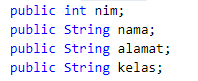 8. Jelaskan pada bagian mana proses pendeklarasian method pada program diatas!
Jawaban : Pada bagian pembuatan class mahasiswa yang mana didalemnya berisi fungsi tampil biodata dan deklarasi atribut.
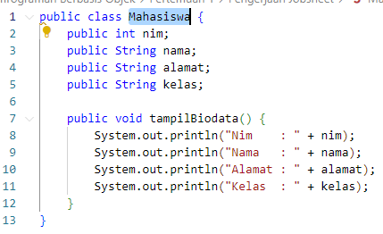 9. Berapa banyak objek yang di instansiasi pada program diatas!
Jawaban : 1 objek saja yaitu Mahasiswa dijadikan mhs1. Yang mana digunakan untuk mengisi data mahasiswa ke 1 dengan biodatanya nim, nama, alamat, kelas dan kemudian ditampilkan biodatanya.
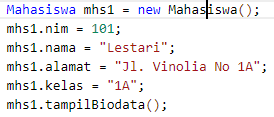 10. Apakah yang sebenarnya dilakukan pada sintaks program “mhs1.nim=101” ?
Jawaban : Berarti objek mhs1 dengan atribut nim itu menyimpan nilai 101 11. Apakah yang sebenarnya dilakukan pada sintaks program “mhs1.tampilBiodata()” ?
Jawaban : menampilkan data mhs1 yang telah diinputkan semisal data yang diinput hanya nama dan nim maka yang muncul nilainya nama dan nim saja yang lainnya bernilai null. Jadi tetap memunculkan semua yang ada di fungsi tampil data. 12. Instansiasi 2 objek lagi pada program diatas!

**Percobaan 3**
no 1-6 program 7. Apakah fungsi argumen dalam suatu method?
Jawaban : Memberi nilai yang harus dieksekusi dalam fungsi tersebut. 8. Ambil kesimpulan tentang kegunaan dari kata kunci return , dan kapan suatu method harus memiliki return!
Jawaban : Kata kunci return digunakan ketika suatu program ada nilai kembalinya seperti bertipe data int double dan yang lain yang didalamnya berisi perhitungan entah pertambahan atau yang lainnya. Sehingga return digunakan untuk melihat atau mencetak hasil.

**TUGAS**

1. ada 2 class yaitu class peminjaman 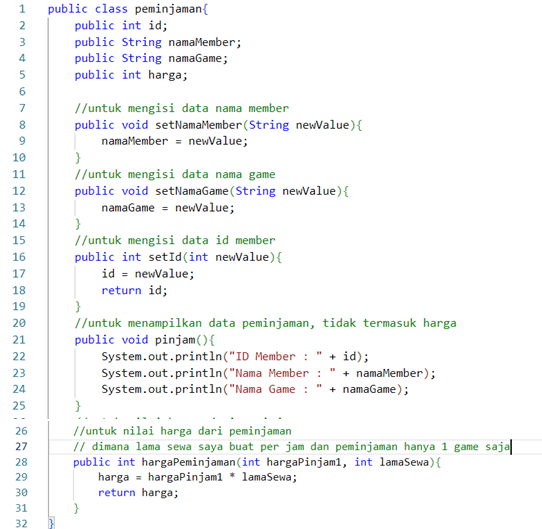 dan peminjamanMain 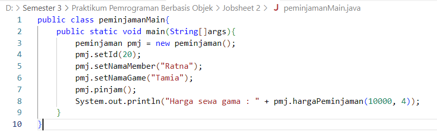
   Running program no 1 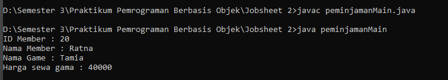
2. Membuat class diagram dari studi kasus 1 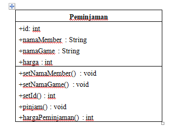
3. ada 2 class yaitu class lingkaran 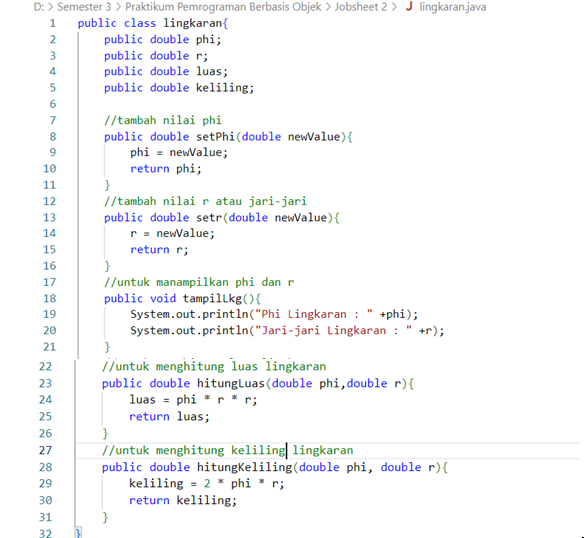 dan lingkaranMain 
   Running program no 3 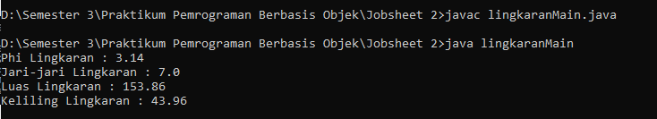
4. 3. ada 2 class yaitu class barang 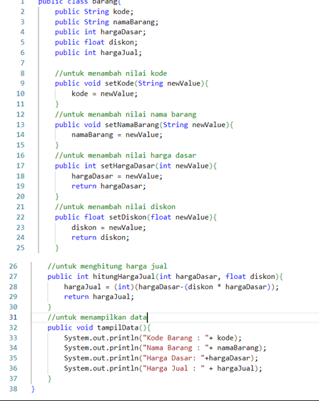 dan barangMain 
      Running program no 4 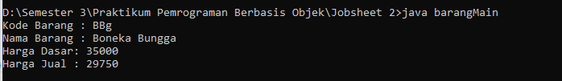
