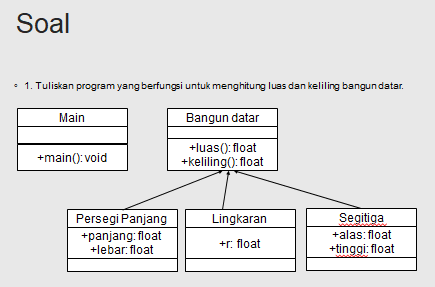

Nama : Ratnasari
Kelas : TI 2C
Absen : 21
NIM : 2241720007

**TUGAS TEORI**
Soal 
Program : ada 5 class pada package TugasTeori
Running : 

**TUGAS PRAKTIKUM**

**-Pertanyaan Percobaan 1**

1. Pada percobaan 1 diatas program yang dijalankan terjadi error,
   kemudian perbaiki sehingga program tersebut bisa dijalankan dan tidak error!
   Jawaban :
   Perbaikan, perlu tambahan extends ClassA pada ClassB. 
   Running : 
2. Jelaskan apa penyebab program pada percobaan 1 ketika dijalankan terdapat error!
   Jawaban : Dikarenakan kurangnya kata extends classB. Bisa disimpulkan penggunaan extends karena pada classB membutuhkan apa yang ada di classA.

**-Pertanyaan Percobaan 2**

1. Pada percobaan 2 diatas program yang dijalankan terjadi error, kemudian perbaiki sehingga program tersebut bisa dijalankan dan tidak error!
   Jawaban : perbaikan perlu diperbaiki pada classA dan ClassB
   classA : 
   classB : 
   running : 
2. Jelaskan apa penyebab program pada percobaan 1 ketika dijalankan terdapat error!
   jawaban : Penyebabnya karena hak akses pada classA private, jadi agar bisa diakses di classB perlu diganti menjadi akses public.

**-Pertanyaan Percobaan 3**

1. Jelaskan fungsi “super” pada potongan program berikut di class Tabung!
   
   Jawaban : kata kunci super untuk pemanggilan yang merujuk pada member yang ada di perent. jadi super.phi = phi merujuk pada phi yang ada di parent yaitu protected double phi. begitu juga dengan uper.r = r merujuk pada phi yang ada di parent yaitu protected int r.
2. Jelaskan fungsi “super” dan “this” pada potongan program berikut di class Tabung!
   
   Jawaban : Kata kunci super dipakai untuk merujuk pada member dari parent class. Sebagaimana kata kunci this yang dipakai untuk merujuk pada member dari class itu sendiri. jadi super phi dan super r merujuk pada nilai yang ada di parent sedangkan this t merujuk pada nilai t yang terdapat pada satu class.
3. Jelaskan mengapa pada class Tabung tidak dideklarasikan atribut “phi” dan “r” tetapi class tersebut dapat mengakses atribut tersebut!
   Jawaban : karena pada atribut phi dan r menggunakan hak akses protected yang mana ini bisa digunakan untuk private atau public. kemudian pada saat pendeklarasian pada setter yang dibuat mengunakan kata super yang mana ini sudah merujuk pada pendeklarasian atribut phi dan r yang ada di class Bangun.

**-Pertanyaan Percobaan 4**

1. Pada percobaan 4 sebutkan mana class yang termasuk superclass dan subclass, kemudian jelaskan alasannya!
   Jawaban : ClassA merupakan class parent atau superclass, ClassB dan ClassC merupakan subclass. dapat dijabarkan bahwa ClassB merupakan subclass dari ClassA, dan ClassC adalah subclass cari CClassB.
2. Tambahkan kata super() di baris Pertaman dalam konstruktor defaultnya. Coba jalankan kembali class Percobaan4 dan terlihat tidak ada perbedaan dari hasil outputnya!
   
   Runnig : 
   hasilnya sama dikarenakan pemanggilan yang terjadi tetap superclass dulu yang di panggil karena kata super() merujuk pada superclass atau parent.
3. Ublah isi konstruktor default ClassC seperti berikut:
   
   Ketika mengubah posisi super() dibaris kedua dalam kontruktor defaultnya dan terlihat ada error. Kemudian kembalikan super() kebaris pertama seperti sebelumnya, maka errornya akan hilang.
   Jawaban : 
   error disebabkan karena Konstruktor dari parent class tidak dapat diwariskan ke subclass-nya.
   Konsekuensinya, setiap kali kita membuat suatu subclass, maka kita harus memanggil konstruktor parent class di konstruktor subclass.
   Pemanggilan konstruktor parent harus dilakukan pada baris pertama dari konstruktor subclass.
   Sebelum subclass menjalankan konstruktornya sendiri, subclass akan menjalankan constructor superclass terlebih dahulu.
   Hal ini terjadi karena secara implisit pada constructor subclass ditambahkan pemanggilan super()yang bertujuan memanggil constructor superclass oleh kompiler.

4. Apakah fungsi super() pada potongan program dibawah ini di ClassC!
   
   Jawaban :
   Pemanggilan konstruktor parent harus dilakukan pada baris pertama dari konstruktor subclass.jadi pada saat subclass menjalankan constructor sendiri subclass akan otomatis menjalankan constructor superclassnya terlebih dahulu setelah itu menjalankan apa yang ada di constructor subclas.

**TUGAS PRAKTIKUM**
Soal 
Program : ada 4 class pada package Tugas
Running : 
