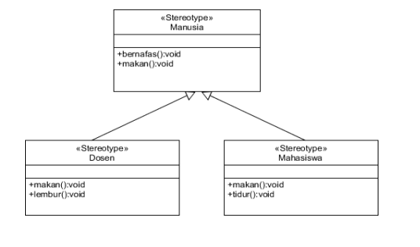

**_Nama : Ratnasari_**
**_Kelas : TI_2C_**
**_NIM : 2241720007_**

**CUPLIKAN MATERI**
Overloading terjadi ketika dua atau lebih metode dalam suatu kelas (atau dalam kelas yang berbeda dalam kasus overriding) memiliki nama yang sama tetapi memiliki parameter yang berbeda dalam hal jumlah, tipe, atau urutan. Dengan kata lain, overloading memungkinkan definisi beberapa versi dari metode dengan nama yang sama, tetapi dengan cara yang berbeda untuk menangani tipe dan jumlah parameter yang berbeda.

Overriding terjadi ketika sebuah kelas turunan (subclass atau child class) menyediakan implementasi yang sama nama dan tipe kembalian dengan metode yang sudah didefinisikan dalam kelas induk (superclass atau parent class). Dengan kata lain, overriding terjadi ketika kita memberikan implementasi yang berbeda untuk suatu metode yang telah didefinisikan di kelas induk.

**PRAKTIKUM PERCOBAAN 1**

ada 4 class yaitu class Karyawan, Staff, Manager dan Utama(ini merupakan class main)
Output Program : 

**LATIHAN**

4.1 Dari source coding diatas terletak dimanakah overloadding?
Jawaban : ada overloading pada method perkalian.

4.2 Jika terdapat overloading ada berapa jumlah parameter yang berbeda?
Jawaban : ada 1 yaitu parameter dengan nilai c bertipe data int. dapat disimpulkan bahwa yang menjadi pembeda ada jumlah dari parameter. berikut penjambarannya :

- void perkalian(int a, int b) Metode ini menggunakan dua parameter bertipe int, jadi menggunakan 2 parameter.
- void perkalian(int a, int b, int c) Metode ini menggunakan dua parameter bertipe int, jadi menggunakan 3 parameter.

4.3 Dari source coding diatas terletak dimanakah overloadding?
Jawaban : ada overloading pada method perkalian.

4.4 Jika terdapat overloading ada berapa jumlah parameter yang berbeda?
Jawaban : ada 4 parameter yang memiliki tipe parameter yang berdeda di dalam 2 metode perkalian:

- void perkalian(int a, int b) Metode ini menggunakan dua parameter bertipe int.
- void perkalian(double a, double b) Metode ini menggunakan dua parameter bertipe double.

namun jika ditanya ada berapa jumlah tipe parameter yang berbeda ada 2 yaitu tipe int dan double.

4.5 Dari source coding diatas terletak dimanakah overriding?
Jawaban : ada pada class Piranha.

4.6 Jabarkanlah apabila sourcoding diatas terdapat overriding?
Jawaban : Pada metode main di kelas Fish, terdapat dua objek yang dibuat a bertipe Ikan dan b bertipe Ikan yang diinisialisasi dengan objek dari kelas Piranha. Pada pemanggilan metode swim, terjadi overriding:

- objek a, metode swim dari kelas Ikan dipanggil, dan pesan yang dicetak adalah "Ikan bisa berenang".
- objek b, meskipun tipe referensi adalah Ikan, tetapi karena objek yang sebenarnya adalah dari kelas Piranha, metode swim yang diambil dari kelas Piranha dipanggil, dan pesan yang dicetak adalah "Piranha bisa makan daging".

Ini berarti meskipun referensi objek adalah dari tipe kelas induk (Ikan), saat runtime metode yang dijalankan adalah metode dari kelas turunannya (Piranha). Inilah yang disebut overriding pada sourcoding.

**TUGAS**

1. Implementasikan konsep overloading pada class diagram dibawah ini:
   
   ada 2 class yang dibuat yaitu
   class Segitiga :
   
   class SegitigaMain :
   

Sehingga output yang dihasilkan :

2. Implementasikan class diagram dibawah ini dengan menggunakan teknik dynamic method dispatch :
sepemahaman saya teknik dynamic method dispatch itu bisa disebut juga dengan overriding yang mana memiliki sifat pewarisan dan mempunyai sub class yakni class manusia dan class turunannya ada class dosen dan mahasiswa.
Gambar soal :

Yang perlu dibuat ada 4 class, 3 class dari gambar dan 1 class main.
class Manusia:

class Dosen:

class Mahasiswa:

class Main =

Kemudian dari susunan program diatas menghasilkan output sebagai berikut:
