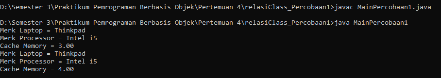
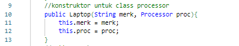

Nama : Ratnasari
Kelas : TI 2C
Absen : 21

**Running Program**

**Pertanyaan**
Berdasarkan percobaan 1, jawablah pertanyaan‑pertanyaan yang terkait:

1. Di dalam class Processor dan class Laptop , terdapat method setter dan getter untuk
   masing‑masing atributnya. Apakah gunanya method setter dan getter tersebut ?
   Jawaban: function setter digunakan untuk memberikan set nilai. Sedangkan getter digunakan untuk menghasilkan suatu nilai dari hasil perhitungan.

2. Di dalam class Processor dan class Laptop, masing‑masing terdapat konstruktor default dan konstruktor berparameter. Bagaimanakah beda penggunaan dari kedua jenis konstruktor tersebut ?
   Jawaban: Konstruktor digunakan untuk menginisialisasi atau memberikan nilai (melalui parameter) kepada sebuah objek pada saat objek pertama kali diciptakan. jika menginisialisasi beberapa objek dengan konstruktor default, semua nilai objek akan sama maksutnya seperti ini kompiler Java akan memanggil konstruktor default. Ini akan menginisialisasi objek dengan nilai default, dan nilai yang sama ditampilkan di output. Konstruktor berparameter di Java digunakan untuk menentukan status objek selama inisialisasi. Konstruktor berparameter memerlukan satu atau lebih argumen untuk diteruskan selama inisialisasi suatu objek. Untuk pengubah akses "publik" dan "default", pengubah akses konstruktor sama dengan pengubah akses kelas tempat konstruktor tersebut berada.

3. Perhatikan class Laptop, di antara 2 atribut yang dimiliki (merk dan proc), atribut manakah yang bertipe object ?
   Jawaban: atribut proc yang mana meiliki tipe data Processor yang menunjukkan bahwa atribut ini adalah sebuah objek yang mewakili informasi tentang prosesor laptop.

4. Perhatikan class Laptop, pada baris manakah yang menunjukan bahwa class Laptop
   memiliki relasi dengan class Processor ?
   Jawaban: pada konstruktor berparameter
   

5. Perhatikan pada class Laptop , Apakah guna dari sintaks proc.info() ?
   Jawaban : untuk manampilkan nilai proc dengan menggunakan method info()

6. Pada class MainPercobaan1, terdapat baris kode: Laptop l = new Laptop("Thinkpad", p);. Apakah p tersebut ? Dan apakah yang terjadi jika baris kode tersebut diubah menjadi:Laptop l = new Laptop("Thinkpad", new Processor("Intel i5", 3)); Bagaimanakah hasil program saat dijalankan, apakah ada perubahan ?
   Jawaban : tidak ada perubahan
   
