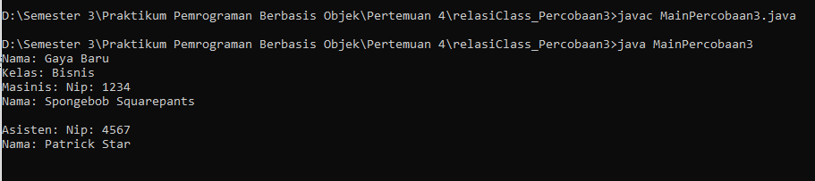
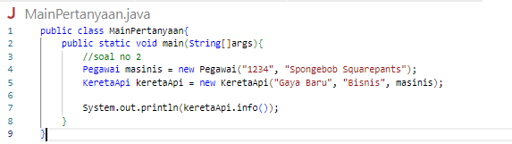
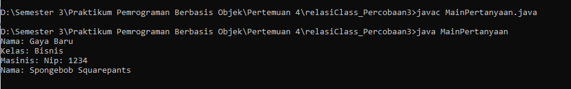

Nama : Ratnasari
Kelas : TI 2C
Absen : 24

**Runing Program**

**Pertanyaan**

1. Di dalam method info() pada class KeretaApi, baris this.masinis.info() dan
   this.asisten.info() digunakan untuk apa ?
   Jawaban : Jadi, ketika method info() dari objek KeretaApi dipanggil, baris this.masinis.info() dan this.asisten.info() mengakses method info() dari objek masinis dan asisten untuk mendapatkan informasi atau detail tertentu tentang masinis dan asisten yang sedang mengoperasikan kereta api tersebut.

2. Buatlah main program baru dengan nama class MainPertanyaan pada package yang sama. Tambahkan kode berikut pada method main() !
   Pegawai masinis = new Pegawai("1234", "Spongebob Squarepants");
   KeretaApi keretaApi = new KeretaApi("Gaya Baru", "Bisnis", masinis);
   System.out.println(keretaApi.info());
   Jawaban : 

3. Apa hasil output dari main program tersebut ? Mengapa hal tersebut dapat terjadi ?
   Jawaban : karena konstruktor berparameternya double dan tidak tepat sehinga perlu membenahi konstruktor nya

4. Perbaiki class KeretaApi sehingga program dapat berjalan !
   Jawaban : 
