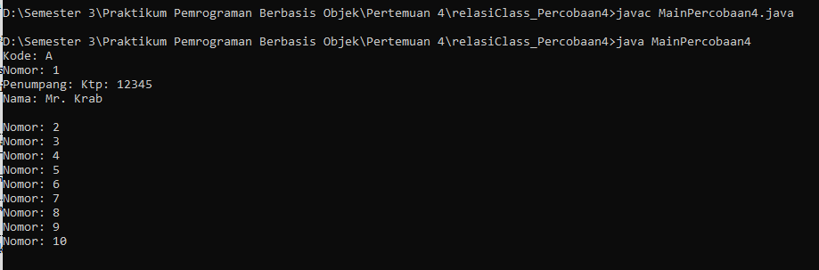
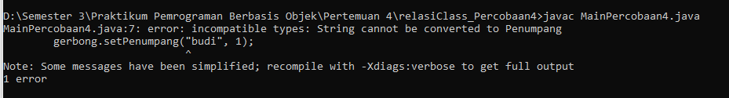
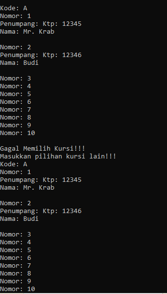

Nama : Ratnasari
Kelas : TI 2C
Absen : 21

**Running program Percobaan 4**

**Pertanyaan**

1. Pada main program dalam class MainPercobaan4, berapakah jumlah kursi dalam Gerbong A ?
   Jawaban = ada 10 kursi

2. Perhatikan potongan kode pada method info() dalam class Kursi. Apa maksud kode tersebut ?
   if (this.penumpang != null) {
   info += "Penumpang: " + penumpang.info() + "\n";
   }
   Jawaban = jika data penumpang tidak null/ tidak kosong akan ditambahkan data penumpang dengan memangil method penumpang.info()

3. Mengapa pada method setPenumpang() dalam class Gerbong, nilai nomor dikurangi dengan angka 1 ?
   Jawaban = pengurangan nilai nomor dengan 1 digunakan untuk mengonversi nomor kursi yang dimulai dari 1 menjadi indeks array yang dimulai dari 0 sehingga kita dapat mengatur penumpang pada kursi yang sesuai dalam array.

4. Instansiasi objek baru budi dengan tipe Penumpang, kemudian masukkan objek baru tersebut pada gerbong dengan gerbong.setPenumpang(budi, 1). Apakah yang terjadi ?
   Jawaban = yang terjadi ialah error karena pada array pertama/nomer satu sudah terisi. dan satu kali instansiansi itu hanya bisa diisi satu data/nilai saja.
   

5. Modifikasi program sehingga tidak diperkenankan untuk menduduki kursi yang sudah ada penumpang lain !
   Jawaban = 
