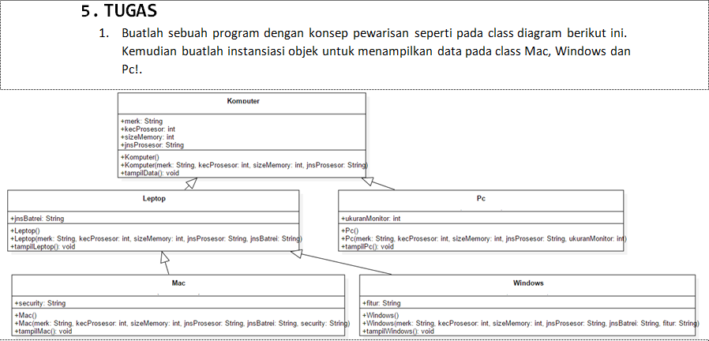

Nama : Ratnasari
Kelas : TI 2C
Absen : 21
NIM : 2241720007

**--Percobaan 1**
File Java Percobaan 1 ada di folder percobaan 1
Output percobaan 1

**--Pertanyaan Percobaan 1**

1. Sebutkan class mana yang termasuk super class dan sub class dari percobaan 1 diatas!
   Jawaban : super class nya adalah Karyawan dan sub class nya ada Manager dan Staff.

2. Kata kunci apakah yang digunakan untuk menurunkan suatu class ke class yang lain?
   Jawaban : extends. contoh menurunkan class karyawan ke class staff "public class staff extends karyawan"

3. Perhatikan kode program pada class Manager, atribut apa saja yang dimiliki oleh class tersebut? Sebutkan atribut mana saja yang diwarisi dari class Karyawan!
   Jawaban : atribut yang dimiliki class Manager adalah tunjangan yang bertipe data int. dan atribut yang diwarisi dari class Karyawan ada nama, alamat, jk yang bertipe data String dan umur, gaji yang bertipe data int.

4. Jelaskan kata kuncisuper pada potongan program dibawah ini yang terdapat pada class Manager!
   
   Jawaban : jadi dia merujuk pada atribut gaji di super class yaitu class karyawan. yang mana jika dipanggil yang akan muncul ialah niali atribut dari class karyawan.

5. Program pada percobaan 1 diatas termasuk dalam jenis inheritance apa? Jelaskan alasannya!
   Jawaban :
   termasuk Single inheritance, karena programnya kelas Staff mewarisi Karyawan dan manager mewarisi karyawan. mereka hanya mewarisi 2 kelas yang tidak saling terhubung.
   Dalam single inheritance, sebuah kelas hanya dapat mewarisi atribut dan metode dari satu kelas induk (superclass). Ini berarti setiap kelas anak (subclass) hanya memiliki satu kelas induk langsung.

**--Percobaan 2**
File Java Percobaan 2 ada di folder percobaan 2
Output percobaan 2

**--Pertanyaan Percobaan 2**

1. Berdasarkan class diatas manakah yang termasuk single inheritance dan mana yang termasuk multilevel inheritance?
   Jawaban :
   termasuk Multilevel inheritance, karena programnya bisa dikatakan memiliki tingkat yang mana kelas staffHarian mewarisi staff dan staff mewarisi karyawan.
   Definisi Multilevel Inheritance (Pewarisan Bertingkat):
   Dalam multilevel inheritance, sebuah kelas anak (subclass) menjadi kelas induk (superclass) untuk kelas lainnya. Dengan kata lain, ada beberapa tingkatan pewarisan yang terjadi, di mana satu kelas mewarisi dari kelas lain yang kemudian dapat menjadi kelas induk lagi.

2. Perhatikan kode program class StaffTetap dan StaffHarian, atribut apa saja yang dimiliki oleh class tersebut? Sebutkan atribut mana saja yang diwarisi dari class Staff!
   Jawaban :
   pada class StaffTetap : yang diwariskan dari class Staff atribut nama, alamat, jk, umur, gaji, lembur, potongan.
   sedangkan atribut dari class StaffTetap sendiri ada golongan dan asuransi.
   sehingga pada class StaffTetap mempunyai tribut nama, alamat, jk, umur, gaji, lembur, potongan, golongan dan asuransi

   pada class StaffHarian : yang diwariskan dari class Staff atribut nama, alamat, jk, umur, gaji, lembur, potongan.
   sedangkan atribut dari class StaffHarian sendiri hanya ada atribut jmlJamKerja.
   sehingga pada class StaffHarian mempunyai tribut nama, alamat, jk, umur, gaji, lembur, potongan dan jmlJamKerja.

3. Apakah fungsi potongan program berikut pada class StaffHarian
   
   Jawaban : gunanya adalah untuk menampilkan atribut yang ada di superclass yakni atribut nama, alamat, jk, umur, gaji, lembur, potongan. superclass yang dimaksut adalah class Staff.

4. Apakah fungsi potongan program berikut pada class StaffHarian
   
   Jawaban : Menampilkan fungsi tampilDataStaff yang ada di class Staff yang mana class Staff ini menjadi superclass dari class StaffHarian.

5. Perhatikan kode program dibawah ini yang terdapat pada class StaffTetap
   
   Terlihat dipotongan program diatas atribut gaji, lembur dan potongan dapat diakses langsung. Kenapa hal ini bisa terjadi dan bagaimana class StaffTetap memiliki atribut gaji, lembur, dan potongan
   Jawaban :
   Dalam definisi di atas, atribut-atribut gaji, lembur, potongan, dan asuransi didefinisikan sebagai atribut publik, yang berarti mereka dapat diakses secara langsung dari luar kelas StaffTetap. Jadi, jika memiliki objek dari kelas StaffTetap, dapat mengakses atribut-atribut ini seperti yang ditunjukkan dalam pernyataan System.out.println.

**Tugas**
Soal : 
ada 6 class :
class Komputer : 
class Leptop : 
class Pc = 
class Mac = 
class Windows = 
Running : 
