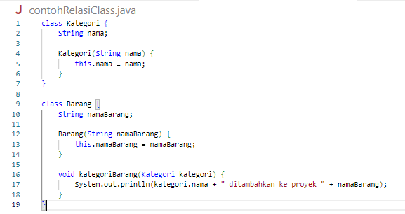
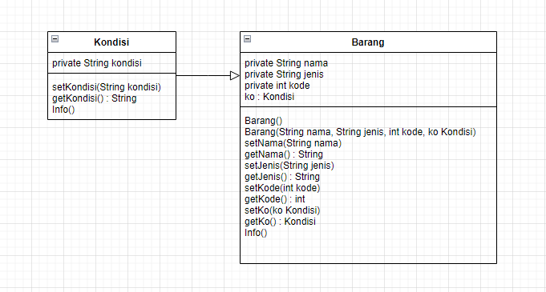

Nama : Ratnasari
Kelas : TI 2C
NIM : 2241720007
Absen : 21

**QUIZ 1**

**1. Class dan Object:**

- Apa yang dimaksud dengan "class" dalam pemrograman berorientasi objek?
  Jawaban : Class merupakan sebuah pola atau template dari objek yangmemiliki anggota yang sama seperti struktur dan ciri-ciri nya,
  dan sebuah class mempunyai anggota yang terdiri dari atribut dan method.

- Bagaimana Anda mendefinisikan objek dari suatu class dalam bahasa
  pemrograman Java?
  Jawaban : cara untuk mendefinisikan class, menggunakan kata kunci class dan diikuti dengan nama class yang akan dibuat,
  nama harus berupa kata benda dengan diawali huruf kapital contoh:
  **public class Perahu{**

**}**

- Misalkan Anda memiliki class "Barang" dalam sistem informasi inventaris.
  Bagaimana Anda akan membuat objek "laptop" dari class tersebut?
  Jawaban : dengan cara instansiansi
  Barang laptop = new Barang();

**2. Encapsulation:**

- Jelaskan konsep encapsulation dalam pemrograman berorientasi objek dan
  mengapa hal ini penting dalam pengembangan sistem informasi inventaris barang.
  Jawaban : Konsep encapsulation adalah salah satu prinsip dalam pemrograman berorientasi objek (OOP)
  yang mengacu pada pembungkusan atau penyembunyian detail internal dari sebuah objek,
  sehingga hanya operasi-operasi tertentu yang dapat mengakses dan memodifikasi data dalam objek tersebut.
  jadi bisa dikatakan yang dilihatkan hanya yang ada di main sementara untuk fungsi ada di class tersendiri,
  gunanya untuk mempermudah dan menjadikan program tersebut lebih flexibel saat digunakan. fungsi atau method
  yang bisa diakses contoh nya adalah setter dan getter.
  Penerapan konsep encapsulation dalam pengembangan sistem informasi inventaris barang,
  dapat meningkatkan keamanan, pemeliharaan, dan keberlanjutan sistem serta membuat sistem lebih mudah untuk dikelola
  dan ditingkatkan seiring berjalannya waktu dengan perubahan yang pastinya bervariasi.

- Dalam konteks sistem informasi inventaris, sebutkan contoh atribut (variabel) yang
  harus di-encapsulate dan mengapa.
  Jawaban :
  nama barang = untuk pendataan nama barang yang tersedia.
  id barang = untuk melindungi integritas data dan mencegah duplikasi ID barang yang tidak diinginkan.
  stok barang = menghitung dengan konsisten dan benar terkait jumlah barang yang tersedia.
  tanggal masuk = membantu perhitungan stok dan pengiriman barang menggunakan tanggal
  yang konsisten menjadikan patokan penambahan stok barang.

**3. Relasi Kelas:**

- Apa yang dimaksud dengan relasi antara kelas dalam pemrograman berorientasi
  objek?
  Jawaban : merupakan suatu class yang memiliki jaringan atau keterkaitan antar class satu dengan yang class lain.
  bisa disimpulkan bahwa class itu merupakan sebuah class yang bergantung atau berhubungan dengan class lain,
  yang bergantung bisa saja method atau hal yang lain.

- Dalam sistem informasi inventaris barang, bagaimana Anda akan menggambarkan
  relasi antara kelas "Barang" dan kelas "Kategori"?
  Jawaban : 
  Dalam contoh ini, terdapat dua class, yaitu Barang dan kategori, yang memiliki hubungan asosiasi.
  Class Kategori memiliki metode kategoriBarang() yang mengizinkan class Barang untuk ditambahkan ke dalam Kategori tertentu.

**4. PBL:**

- Berdasarkan kasus sistem informasi inventaris barang, coba buat sebuah class
  sederhana beserta atribut dan metodenya yang menggambarkan suatu entitas
  dalam sistem tersebut (misalnya, class "Barang").
  Jawaban :
  
  

- Bagaimana Anda akan menggunakan encapsulation untuk melindungi atribut atribut dalam class tersebut?
  Jawaban : bisa menggunakan pendeklarasian atribut dengan private
  yang artinya atribut tersebut hanya bisa diakses didlam class tersekait class lain tidak bisa mengakses.
  bisa juga menggunakan metode aksesor (getter) dan mutator (setter) yang mana hanya bisa memanggil method nya saja
  tanpa tau apa yang program kerjakan pada method tersebut. karena pada dasarnya method getter untuk mendapatkan nilai atribut,
  sedangkan method setter untuk mengatur nilai atribut.

- Gambarkan hierarki class atau hubungan antar class yang mungkin ada dalam
  sistem informasi inventaris barang di jurusan Teknologi Informasi. Berikan contoh
  relasi antar class (misalnya, inheritance atau association) dalam konteks tersebut.
  Jawaban : 
  maksut dari gambar tersebut adalah class kondisi yang mana ini merujuk pada kondisi barang inventaris
  (rusak, dipinjam, ada, perlu diperbaiki, dsb) yang mana dia berelasi pada class Barang.
  yang artinya class kondisi digunakan pada class Barang yang mana ini menggunakan association.
