Nama : Ratnasari
Kelas : TI 2C
Absen : 21
NIM : 2241720007

**UTS**

1.  Penulisan Class
    Berdasarkan contoh class ClassA di bawah ini, jelaskan apakah penulisan source code pada contoh
    class tersebut sudah benar. Jika tidak, apa yang perlu diperbaiki?
    public class ClassA {
    float f1 = 0.15f;
    float hitung() {
    float x = 2f \* f1;
    }
    }
    Jawaban : belum benar perlu diperbaiki, karena jika menggunakan fungsi yang bertipe data float atau int kita perlu menambah nilai kembalian atau return didalamnya.
    bukti : 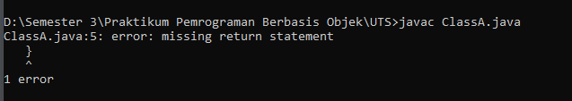
    Perbaikan yang diperlukan : 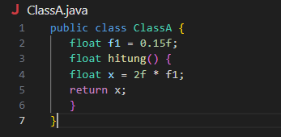

2.  Perhitungan Jumlah Elemen Array 2 Dimensi
    Pada class SoalArray1, terdapat array 2 dimensi dengan ukuran 3x3. Tuliskan code Java untuk
    menghitung jumlah total elemen array tersebut dengan menggunakan perulangan.
    public class SoalArray1 {
    public static void main(String[] args) {
    int[][] arrayInt = {{1, 1, 4}, {2, 1, 2}, {3, 2, 1}};
    // hitung jumlah elemen array 2 dimensi
    // gunakan perulangan
    }
    }
    Jawaban :
    // hitung jumlah elemen array 2 dimensi gunakan perulangan :
    for (int i = 0; i < arrayInt.length; i++) {
    for (int j = 0; j < arrayInt[i].length; j++) {
    total += arrayInt[i][j]; // Menambahkan elemen ke total
    }
    }
    Class SoalArray1 : 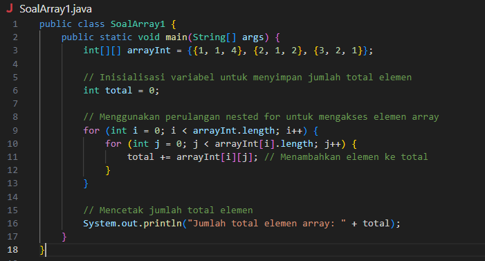
    Running SoalArray1 : 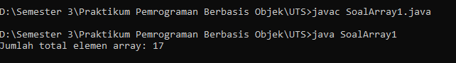
3.  Pewarisan Atribut dan Method
    Pada source code yang diberikan, class ClassY merupakan turunan dari class Class. Sebutkan atribut
    dan method apa saja yang diwarisi oleh ClassY dari kelas induknya (class Class). Jelaskan juga apa
    output dari code yang ditulis pada class ClassY dan bagaimana nilai tersebut diperoleh.
    public class Class {
    int a = 2;
    int x = 0;
    int hitung() {
    x = x + 5 _ a;
    return x;
    }
    }
    public class ClassY extends Class {
    int b = 5;
    int y = 0;
    int hitungY() {
    y = hitung() _ b;
    return y;
    }
    public static void main(String[] args) {
    ClassY cy = new ClassY();
    System.out.println(cy.hitungY());
    }
    }
    Jawaban :
    atribut yang diwarisi dari class induk yang itu Class adalah a dan x yang bertipe data integer dan methodnya ada method hitung()
    pada classY terdapat method hitungY() yang mana didalamnya terdapat atribut y yang mana diperoleh dari method hitung() yang mengambil dari class indux dikalikan dengan nilai b.
    method hitung sendiri didapatkan dari pencarian nilai atribut x = x + 5 _ a kemudian nilai x di returnkan, dari sini sudah diketahui bahwasanya nilai x = 10.
    kemudian di class ClassY y = hitung() _ b = 10 \* 5 = 50.
    jadi outputnya adalah 50.
    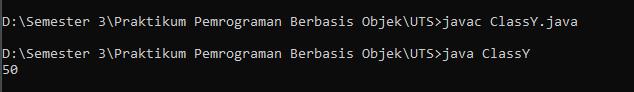

4.  Class Mahasiswa dengan Constructor
    Dalam class Mahasiswa, lengkapi code dengan:
    a. Menambahkan constructor untuk mengisi atribut nim, nama, alamat, dan jenisKelamin.
    b. Membuat objek mahasiswa dan mengisi atribut nim, nama, alamat, dan jenisKelamin melalui
    constructor.
    public class Mahasiswa {
    String nim, nama, alamat;
    char jenisKelamin;
    // a. Tambahkan constructor
    // Gunakan constructor untuk
    // mengisi atribut nim, nama, alamat, jenisKelamin

        public static void main(String[] args) {
        // b. Buat objek mahasiswa
        // Isi atribut nim, nama, alamat, jenisKelamin
        // lewat constructor
        }
        }

    Jawaban :
    a. constructor untuk mengisi atribut nim, nama, alamat, dan jenisKelamin.
    public Mahasiswa(String nim, String nama, String alamat, char jenisKelamin){
    this.nim = nim;
    this.nama = nama;
    this.alamat = alamat;
    this.jenisKelamin = jenisKelamin;
    }
    b.Membuat objek mahasiswa dan mengisi atribut nim, nama, alamat, dan jenisKelamin melalui
    constructor.
    Mahasiswa m = new Mahasiswa("224172007", "Ratnasari", "Malang", 'P');

    kemudian ditambah dengan function untuk menampilkan data pada constructor:
    public void tampilData(){
    System.out.println("NIM = " + nim);
    System.out.println("Nama = " + nama);
    System.out.println("Alamat = " + alamat);
    System.out.println("Jenis Kelamin = " + jenisKelamin);
    }
    dan ketika di class main dipanggil agar keluar datanya :
    m.tampilData();

    class Mahasiswa : 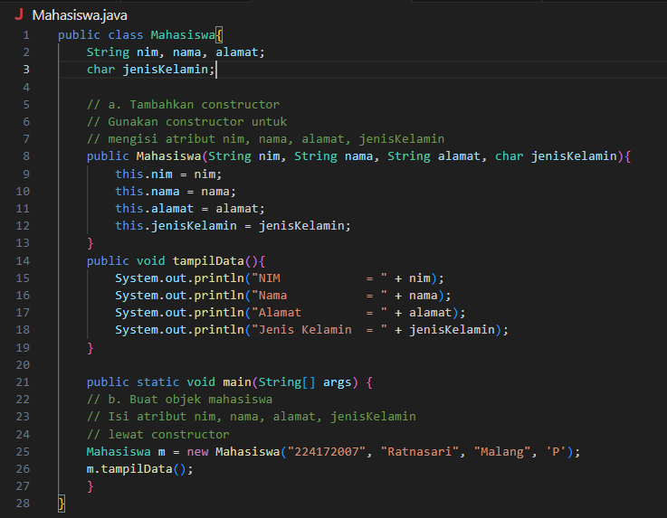
    running class Mahasiswa : 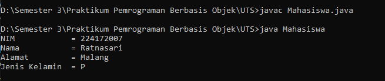

5.  Soal 5: OOP Buku -> Penulis
    Perhatikan class diagaram berikut dan Buatlah Source code dalam Bahasa java berdasarkan class
    diagram tersebut
    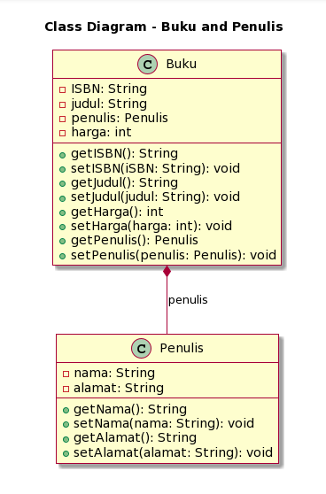
    Jawaban :
    Class Penulis : 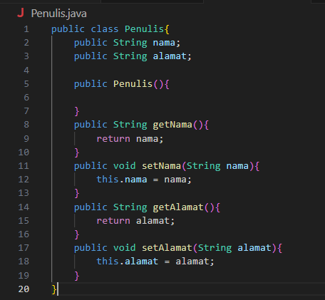
    Class Buku : 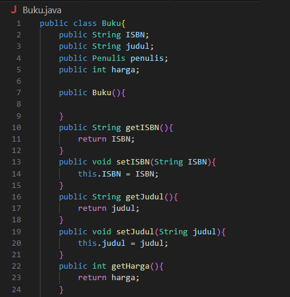 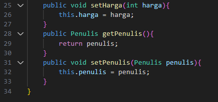
    Class MainSoalNo5 : 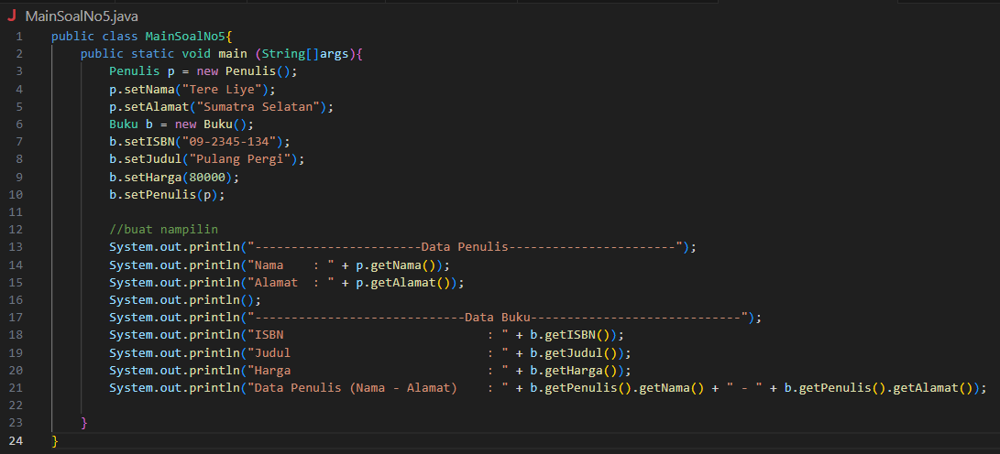
    Output : 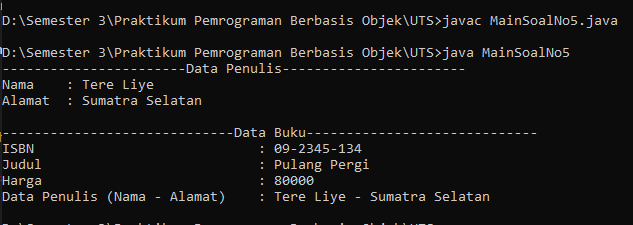
