Nama : Ratnasari
Kelas : TI 2C
Absen : 21
NIM : 2241720007

**Pertanyaan - Percobaan 2**

1. Pada class TestMobil, saat kita menambah kecepatan untuk pertama kalinya, mengapa muncul peringatan “Kecepatan tidak bisa bertambah karena Mesin Off!”?
   Jawaban : Karena mesin saat itu posisi off atau mati jadi ridak bisa bertambah kecepaatnnya. Karena hanya bisa bertambah kecepatan saat mesin on

2. Mengapat atribut kecepatan dan kontakOn diset private?
   Jawaban : karena hanya digunakan untuk akses di class motor saja.

3. Ubah class Motor sehingga kecepatan maksimalnya adalah 100!
   Jawaban : gambar program 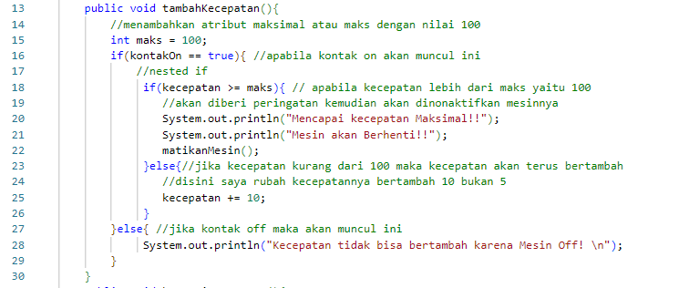
   gambar running 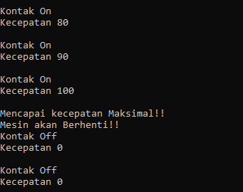

**Pertanyaan – Percobaan 3 dan 4**

1. Apa yang dimaksud getter dan setter?
   Jawaban :
   getter = public method dan memiliki tipe data return, yang berfungsi untuk mendapatkan nilai & atribut private.
   setter = public method yang tidak memiliki tipe data return,yang berfungsi untuk memanipulasi nilai dan atribut private.

2. Apa kegunaan dari method getSimpanan()?
   Jawaban : untuk data simpanan yang ada berdasarkan setor dan pinjaman

3. Method apa yang digunakan untk menambah saldo?
   Jawaban : setor

4. Apa yand dimaksud konstruktor?
   Jawaban : method yang berfungsi untuk menginisalisasi variabel yang akan dimiliki oleh objek. konstruktor dipanggil pada saat proses instansiasi class menjadi objek.

5. Sebutkan aturan dalam membuat konstruktor?
   Jawaban :
   a). nama konstruktor harus sama dengan nama class
   b). konstruktor tidak memiliki tipe data return
   c). konstruktor tidak boleh menggunakan modifier abstract, static, final dan syncronized

6. Apakah boleh konstruktor bertipe private?
   Jawaban : boleh, karena mempunyai kegunaan untuk anti-pola desain tunggal. dan jika sebuah class memiliki konstruktor private maka tidak dapat membuat object dari class tersebut di luar class tersebut.

7. Kapan menggunakan parameter dengan passsing parameter?
   Jawaban :Passing parameter merupakan suatu mekanisme mengirim dan atau mengembalikan suatu nilai kepada fungsi atau prosedur Passing parameter ada 2 jenis yaitu ;

   - Pass by value (parameter nilai), jika di dalam fungsi atau prosedur dilakukan perubahan nilai parameter yang dilewatkan secara nilai, maka nilai parameter yang sebenarnya tidak ikut berubah dikarenakan parameter yang dilewatkan secara nilai akan di copy sebagai nilai lokal di prosedur atau fungsi yang bersangkutan.
   - Pass by reference (parameter variabel), jika di dalam prosedur atau fungsi dilakukan perubahan nilai parameter yang dilewatkan secara reference, maka nilai parameter yang sebenarnya juga akan berubah.

8. Apa perbedaan atribut class dan instansiasi atribut?
   Jawaban :

   - atribut class digunakan untuk digunakan untuk atribut yang nilainya antara objek satu dengan yang lain dari dari suatu class yang sama akan memiliki nilai yang sama
   - atribut instansiasi biasanya digunakan untuk atribut-atribut dari suatu class, dimana nilai dan atribut tersebut untuk objek satu dengan objek yang lain berbeda-beda

9. Apa perbedaan class method dan instansiasi method?
   Jawaban :
   - class method berarti sebuah class yang memiliki sebuah fungsi yang didalamnya entah terdapat pengisian nilai atau pengoperatoran nilai seperti penjumlahan penggurangan dan sebagainya yang intinya untuk melakukan proses tertentu dan bertipe static.
   - instansiasi method digunakan untuk membuat sebuah objek atau sebuah instance pada sebuah class.

**Tugas**

1. Cobalah program dibawah ini dan tuliskan hasil outputnya
   Jawaban : output program 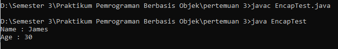

2. Pada program diatas, pada class EncapTest kita mengeset age dengan nilai 35, namun pada saat ditampilkan ke layar nilainya 30, jelaskan mengapa.
   Jawaban :
   Karena nilai age yang memiliki nilai lebih dari 30 akan otomatis tercatat sebagai nilai 30
   

3. Ubah program diatas agar atribut age dapat diberi nilai maksimal 30 dan minimal 18.
   digambar ini tidak ada penjelasan karena penjelasan saya tambahkan di programnya.
   Program Class EncapDemo 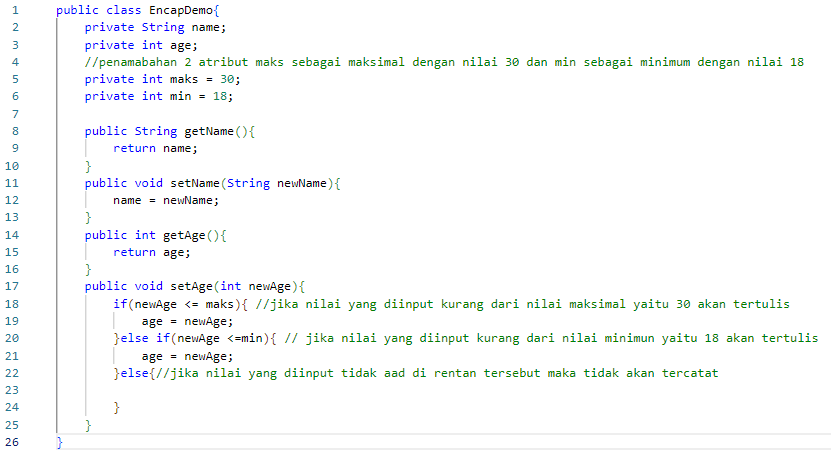
   ada 2 running disini 1 berdasarkan contoh awal yang kedua penambahan sebagai bukti

   - berdasarkan contoh awal
     Program 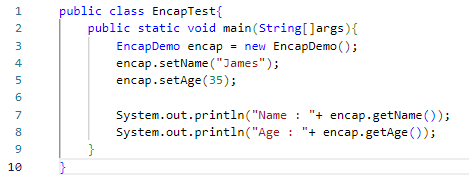
     Running 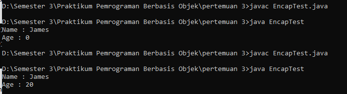
   - Running pengerjaan tugas
     Program 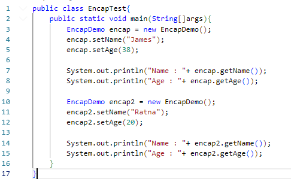
     Running 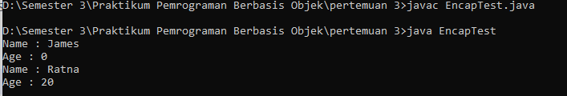

4. Pada sebuah sistem informasi koperasi simpan pinjam, terdapat class Anggota yang memiliki atribut antara lain nomor KTP, nama, limit peminjaman, dan jumlah pinjaman. Anggota dapat meminjam uang dengan batas limit peminjaman yang ditentukan. Anggota juga dapat mengangsur pinjaman. Ketika Anggota tersebut mengangsur pinjaman, maka jumlah pinjaman akan berkurang sesuai dengan nominal yang diangsur. Buatlah class Anggota tersebut, berikan atribut, method dan konstruktor sesuai dengan kebutuhan. Uji dengan TestKoperasi berikut ini untuk memeriksa apakah class Anggota yang anda buat telah sesuai dengan yang diharapkan.
   Jawaban :
   Program 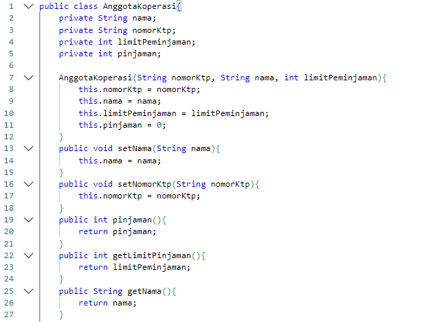 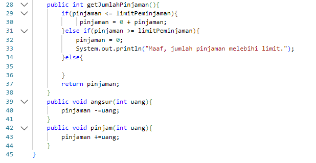
   Running  mohon maaf pak punya saya bisa nya seperti ini

5. Modifikasi soal no. 4 agar nominal yang dapat diangsur minimal adalah 10% dari jumlah pinjaman saat ini. Jika mengangsur kurang dari itu, maka muncul peringatan “Maaf, angsuran harus 10% dari jumlah pinjaman”.
   jawaban :
   Program 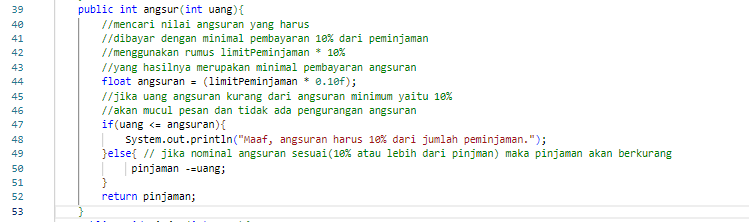 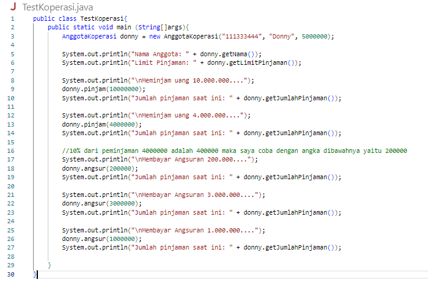
   Running 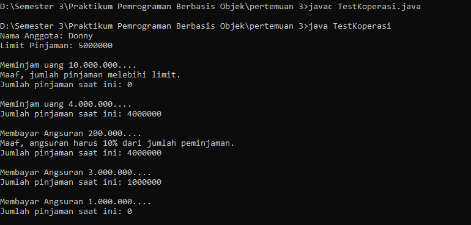

6. Modifikasi class TestKoperasi, agar jumlah pinjaman dan angsuran dapat menerima input dari console.
   Jawaban :
   Program 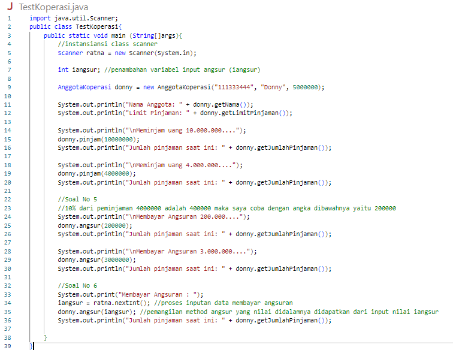
   Running 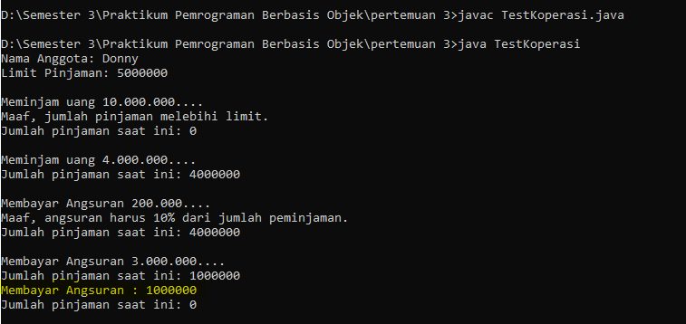
